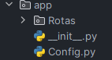

# Sistema de formulário
> by: Thainan Vinicius Katchan

The system is made using the following technologies *Flask, Playwright, SQLAlchemy and serializer for token generation*

## the project structure is separated as follows

- app folder:
- __--init--__.py: Initial project configuration file, where routes start
- __Config.py:__ File for database configuration, SQLAlchemy initialization, serializer and migrate
- __routes folder:__ This folder contains the project routes, divided by files, such as DashBoard.py
- 

___

- __Funcoes folder:__
- Folder responsible for system functions, such as validating CPF, CEP, RG, text formatting and generating tokens.
- 

___

- __Instance, migrate and models folders__:
- __Instance:__ stores the databases in case of using SQlite
- __migrate:__ Folder created when running ```flask db init``` command
- __Models:__ Folder with the classes responsible for creating and configuring the database tables
- 

___

- __Static and Templates folders:__
- static: Folder where the .css and .js files should be placed
- templates: folder to add the .html files
- 

___

- [.flaskenv](.flaskenv)
- Python environment variables file, used to start the project with the ```flask run``` command
- For it to work, the ```python-dotenv``` library must be installed.

___

- [requirements.txt](requirements.txt)
- File for installing the libraries needed to run the project
- to install use the command ```pip install -r requirements.txt```

___

- [run.py](run.py)
- file to start the project
